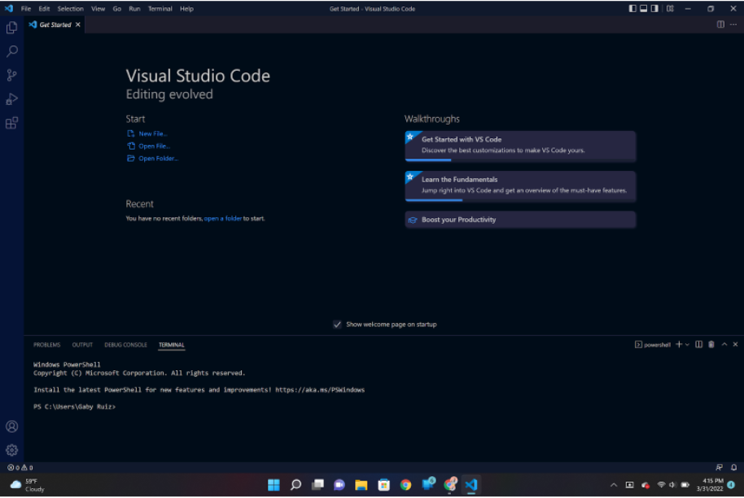
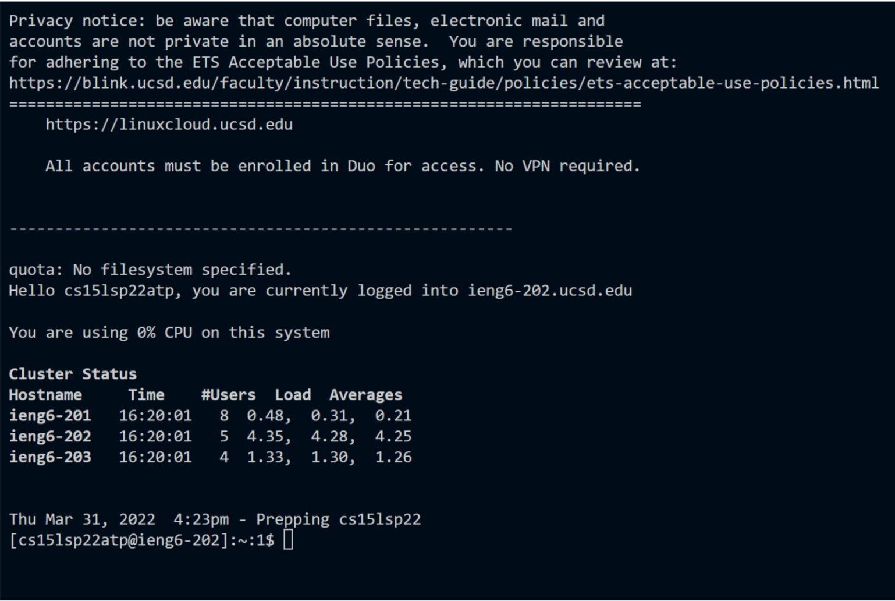
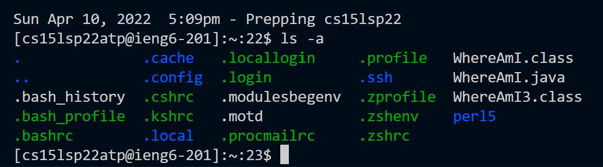
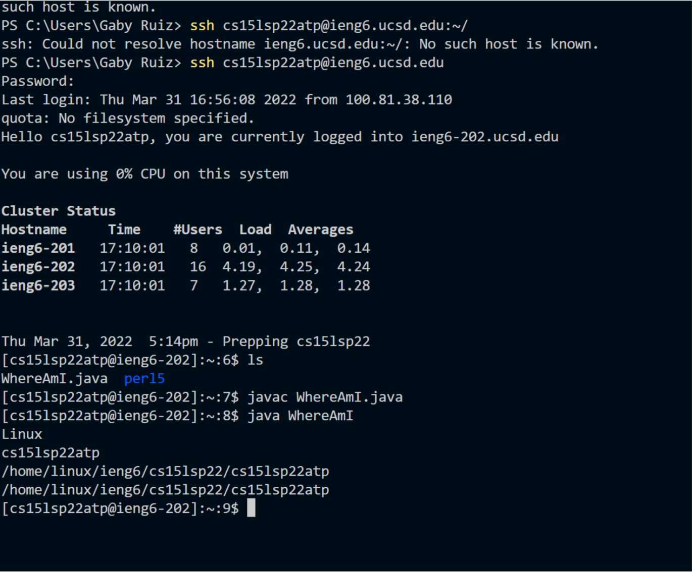
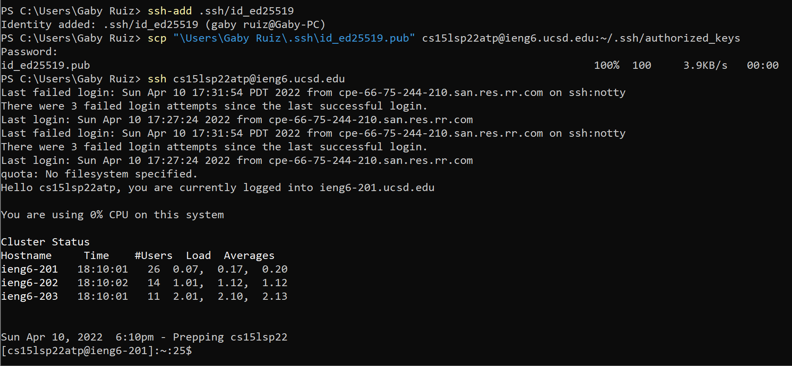
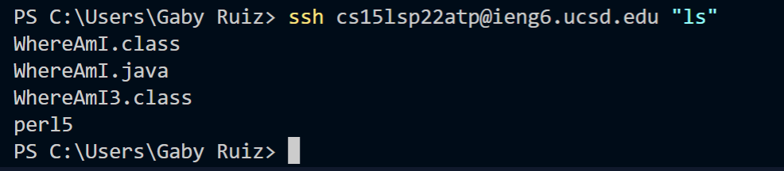

# CSE 15L Lab Reports

## Lab Report 1: Week 2

1. Installing VScode 

The image above displays my VScode starting screen. I download the lastest VScode for Windows, then I changed the theme to my liking.

2. Remotely Connecting

First, I had to install OpenSSH and found my CSE 15L account for the servers (cs15lsp22atp@ieng6.ucsd.edu). I typed in ssh cs15.. in my terminal which then asks for my password. Kept in mind that writing my password does not show up due to sercuity reasons. I am then showed the image above when indcated that I have connected to the server.

3. Trying Some Commands

With my lab group we tested some commands in our terminals to test out each commands. I decied to try out `ls -a`. This gives returns alist the whole lists of the current directory which also includes hidden files. This can be seen in the image above. 

4. Moving Files with `scp` 

If I create a local file on my computer, I can send it to my server account using `scp`. I used the line of code 

`scp WhereAmI.java cs15lsp22atp@ieng6.ucsd.edu:~/` 

on my local terminal. I put in my password. I double checked if the transfer was complete by logging into my server and using 

`ls`

5. Setting an SSH Key

This has taken me so long to figure out. So the first step is to create a key using this code:

`ssh-keygen -t ed25519` 

on powershell as Administrator. Press enter mutiple times till the randomart pops up. EXIT powershell, then run regular powershell on the deskstop and run this code:

`ssh-add .ssh/id_ed25519`

After that, it should say key added, then log into the ieng6 account and run this code:

`mkdir .ssh`

This will create a file called .ssh on the serve. Then exit the server. Lastly you will need to run this code:

`scp "\Users\Gaby Ruiz\.ssh\id_ed25519.pub" cs15lsp22atp@ieng6.ucsd.edu:~/.ssh/authorized_keys`

Put in your password. Then try to log in, it should not ask for a password again.

6. Optmizing Remote Running

Remote running can help when it is a bother to keep logging on the server. Instead run:

`ssh cs15l22atp@ieng6.ucsd.edu "__"`

With the blank being the code you want to run. Note: use ";" to break line in code.