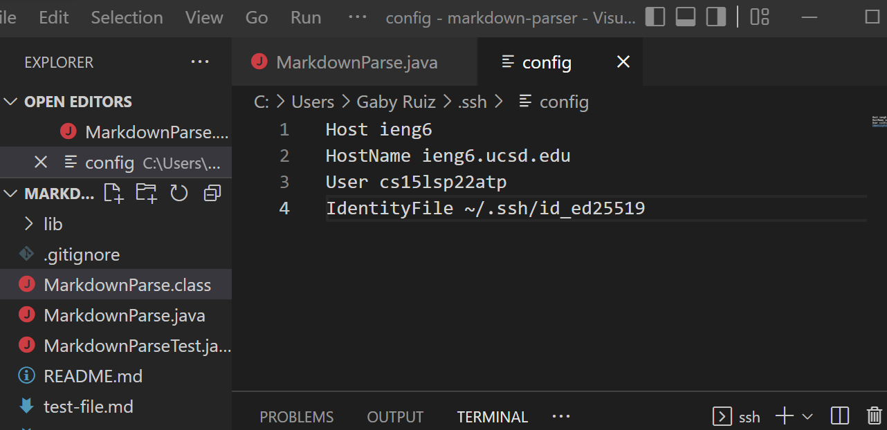
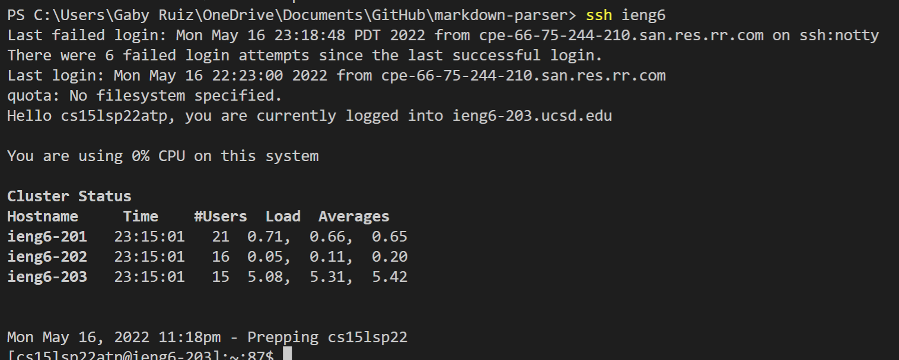
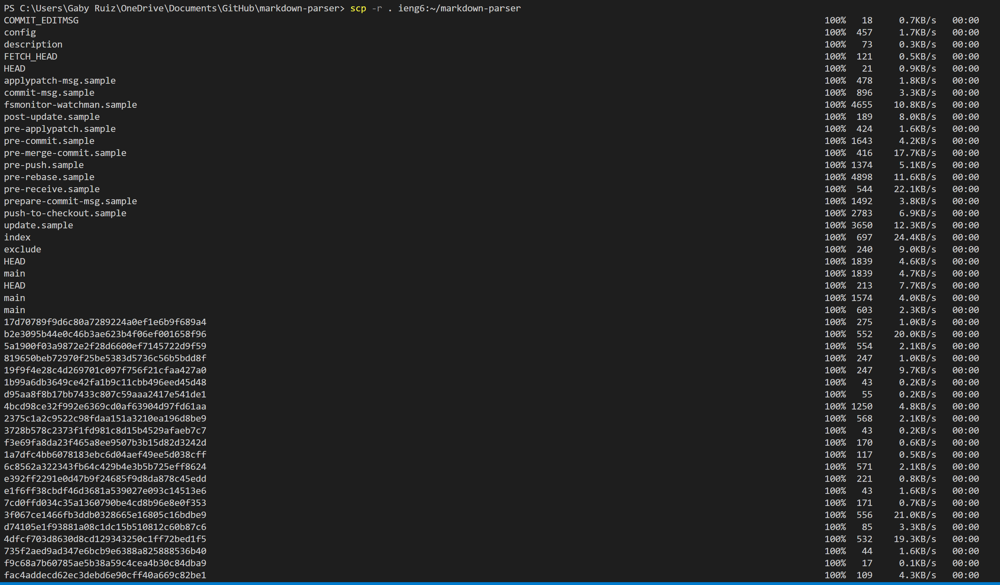
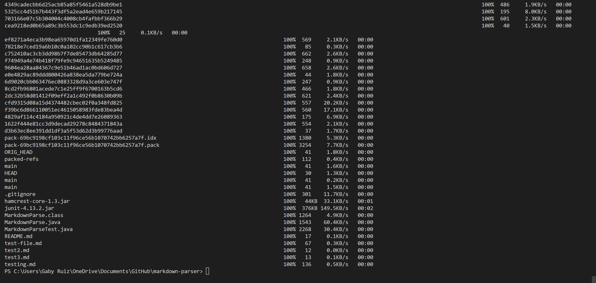

# Lab Report 3

## Streamlining ssh Configuration

### Step 1:
Showing `.ssh/config` file and how I edit it.

### Step 2:
Show the ssh command logging into my account 

### Step 3:
Show an scp command copying a file to my account using my alias.

## Setup Github Access from ieng6

### Step 1:
Show where the public key I made on Github.

### Step 2:
Show where the private key is stored.

### Step 3:
Show running git commands to commit and push changes to Github while still logged into my ieng6 account.

### Step 4:
Show a link for the resulting commit.