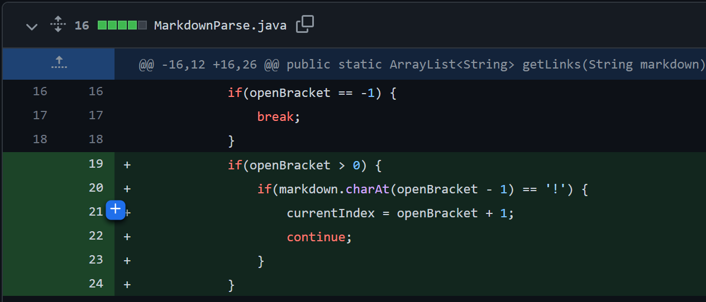
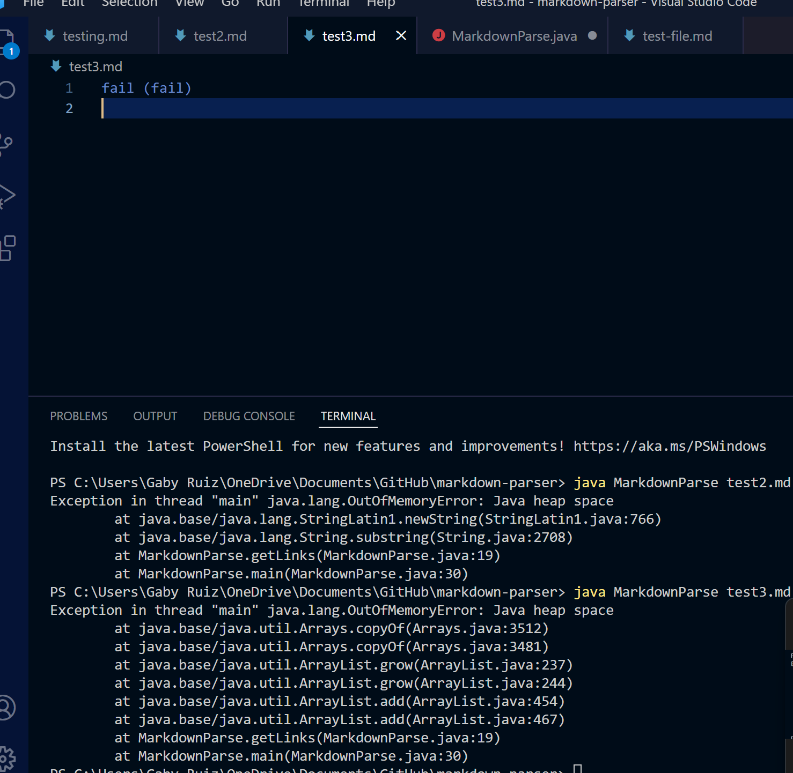
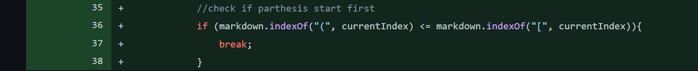
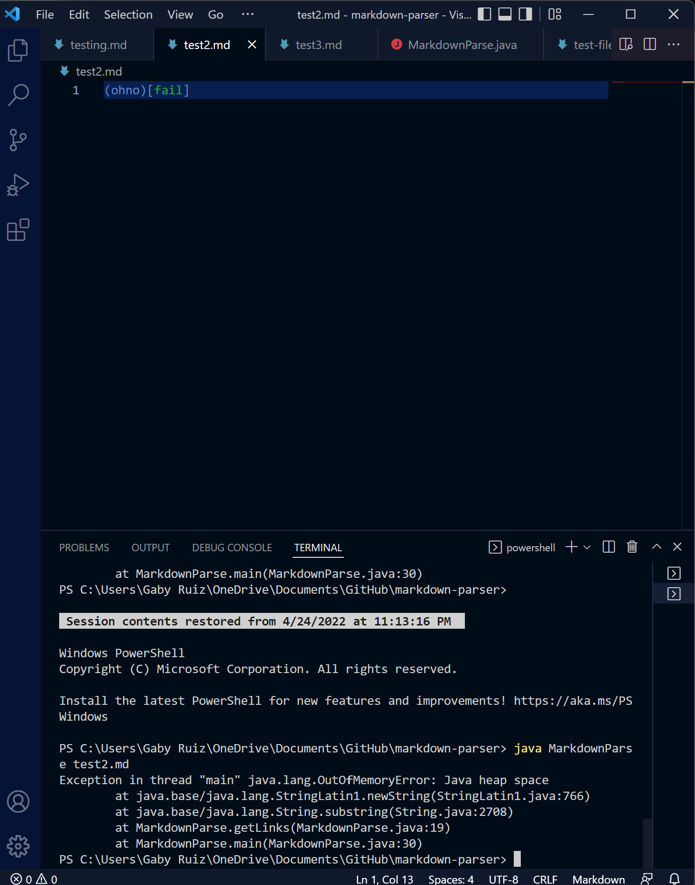
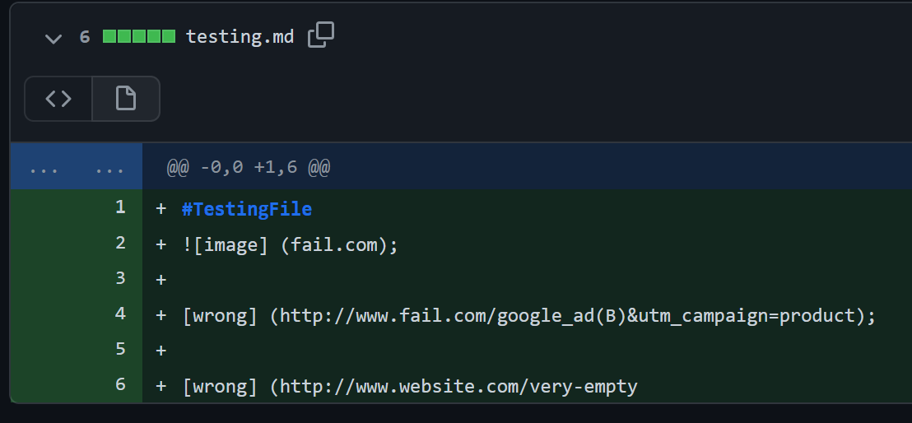
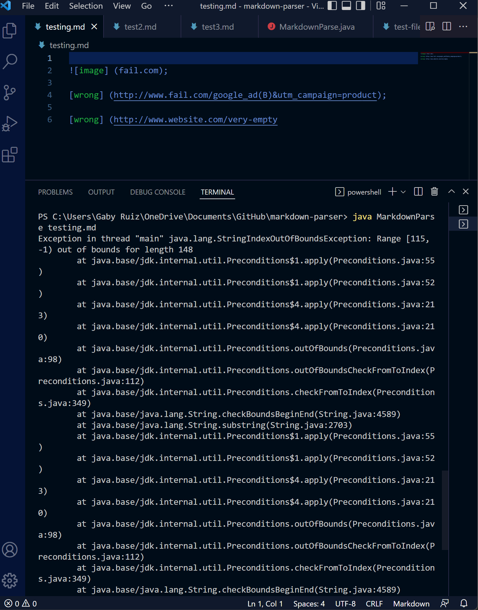

# Lab Report 2

## Code 1:

Link to the failure inducing file:

[Error 1](https://github.com/anifairy/markdown-parser/blob/main/test3.md)

The *bug* in the code was that there was no way to check for incorrect link inputs in the markdown file. Therefore, my group and I used the following code `fail(fail)` for the *failure-inducing input*. When running the file it give us the *symptom* which induces the error.

## Code 2:

Link to the failure inducing file:

[Error 2](https://github.com/anifairy/markdown-parser/commit/7eab1f9f09932b46b2213b31cc55aa1d0f2d69d4)

The *bug* in the code was that there was no way to check if the link was entered incorrectly by switching the brackets and parentheses in the link. Therefore, my group and I used the following code `(ohno)[fail]` for the *failure-inducing input*. When running the file it give us the *symptom* which induces the error.

## Code 3:

Link to the failure inducing file:

[Error 3](https://github.com/anifairy/markdown-parser/commit/f04829af114c4184a950921c4de4dd7e26089363)

The *bug* in the code was that there was no way to check for incorrect link inputs in the markdown file such as an no closed parentheses. Therefore, my group and I used the following code `[wrong] (http://www.website.com/very-empty` for the *failure-inducing input*. When running the file it give us the *symptom* which induces the error.

